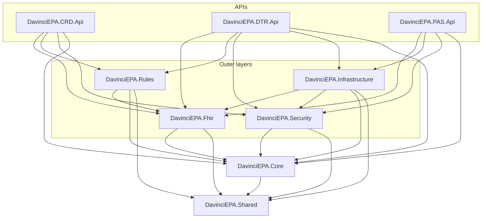
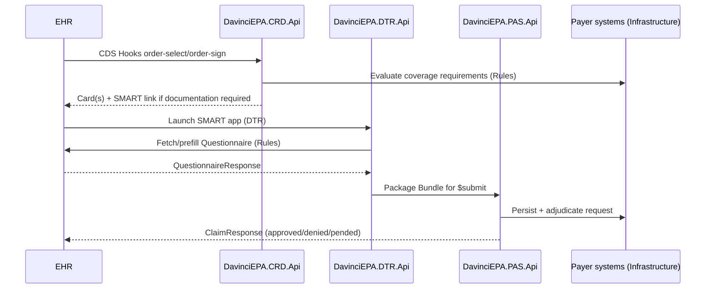

# Architecture

DavinciEPA implements the HL7 Da Vinci Electronic Prior Authorization (EPA) chain end-to-end: **CRD → DTR → PAS**. The solution follows Clean Architecture, isolating domain logic from FHIR, persistence, security, and HTTP concerns.

## Layer diagram

Dependencies only point inward/downward. `Core` and `Shared` have no knowledge of FHIR, EF Core, or ASP.NET Core.

## Layer responsibilities

| Project | Responsibility |
|---|---|
| `DavinciEPA.Shared` | Cross-cutting primitives: `Result<T>`/error types, constants, extension methods. No dependencies. |
| `DavinciEPA.Core` | Domain models, application services (use cases), and port interfaces (repositories, FHIR builders, rule engine, external clients). |
| `DavinciEPA.Fhir` | FHIR R4 resource construction/parsing/validation using the Firely .NET SDK, mapped to/from `Core` domain models. Implements Da Vinci profile conformance. |
| `DavinciEPA.Rules` | Coverage requirement and documentation pre-population rule evaluation (CRD/DTR), consuming FHIR data via `Fhir`. |
| `DavinciEPA.Security` | OAuth2/OIDC, JWT validation, SMART App Launch, CDS Hooks service-token validation, backend-services client-credentials. |
| `DavinciEPA.Infrastructure` | EF Core persistence (repositories), outbound HTTP clients to payer/EHR FHIR servers. |
| `DavinciEPA.CRD.Api` | CDS Hooks service for Coverage Requirements Discovery. |
| `DavinciEPA.DTR.Api` | SMART on FHIR app backend for Documentation Templates and Rules. |
| `DavinciEPA.PAS.Api` | FHIR `Claim`/`ClaimResponse` exchange for Prior Authorization Support. |

## End-to-end workflow

## Why Clean Architecture here

- **Testability** — application/domain logic in `Core` and rule logic in `Rules` can be unit tested without spinning up ASP.NET Core, EF Core, or a FHIR server.
- **Swappable infrastructure** — persistence provider, payer FHIR endpoints, and even the rule-evaluation strategy (declarative rules vs. CQL) can change without touching `Core` or the API projects.
- **Independent deployability** — CRD, DTR, and PAS are separate ASP.NET Core apps that can be deployed, scaled, and versioned independently while sharing the same domain/FHIR/rules foundation.

See also: [folder-structure.md](folder-structure.md), [implementation-order.md](implementation-order.md), [fhir-resources.md](fhir-resources.md).
