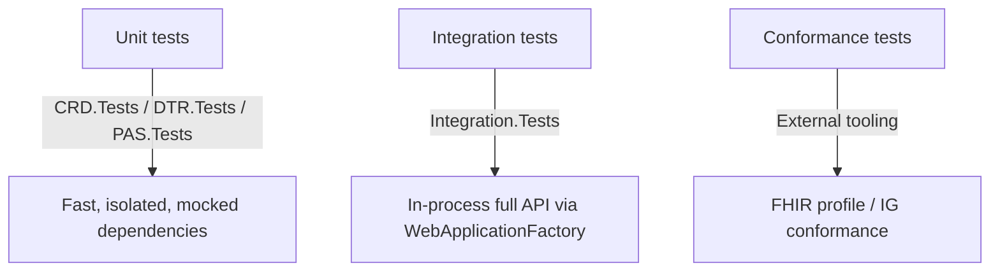

# Testing Strategy

See [testing.instructions.md](../.github/instructions/testing.instructions.md) for concrete conventions. This document covers the overall strategy and tooling.

## Test levels



### 1. Unit tests (`CRD.Tests`, `DTR.Tests`, `PAS.Tests`)
- Target: domain services in `Core`, FHIR builders/parsers in `Fhir`, rule evaluation in `Rules`, and API-specific request/response mapping — scoped to whichever API project first needs the logic.
- Framework: xUnit + a single consistent mocking library (`Moq`) per project.
- All external dependencies (database, payer/EHR HTTP calls, token issuers) are mocked/faked — no real network or database calls.
- Run on every change; must stay fast (seconds, not minutes) to keep the inner dev loop tight.

### 2. Integration tests (`Integration.Tests`)
- Target: full HTTP request/response behavior of each `*.Api` project in-process via `WebApplicationFactory<Program>`, including real FHIR (de)serialization and (where feasible) an in-memory/test database.
- Cover the cross-project happy path (CRD discovery → DTR launch/submit → PAS submit/adjudicate) and key failure paths (invalid FHIR resource, auth failure, unmet coverage requirement).
- Never point at real external payer/EHR endpoints — use test doubles/fakes registered via DI overrides in the test host.

### 3. FHIR conformance testing
- Beyond unit-level profile assertions (required elements, `Meta.Profile`), periodically validate generated resources against the official Da Vinci CRD/DTR/PAS StructureDefinitions using an external validator (e.g. the HL7 FHIR validator CLI, or a Touchstone/Inferno-style test kit) as part of hardening (see [development-roadmap.md](development-roadmap.md) Phase 10).
- Track any known non-conformance as an explicit, tracked gap — do not claim IG support that hasn't been conformance-tested.

## Test data policy

- All test fixtures use clearly synthetic data (e.g. `Patient/example`, fake NPIs/member IDs). Never copy real patient data, even anonymized-looking real-world samples, into test fixtures.
- Shared FHIR test fixtures (minimal valid `Claim`, `QuestionnaireResponse`, etc.) should be built once as reusable helpers rather than duplicated per test file.

## Coverage expectations

- New/changed logic in `Core`, `Fhir`, `Rules` requires unit tests (happy path + at least one edge/failure case).
- New/changed endpoints require an `Integration.Tests` case.
- Bug fixes require a regression test that fails before the fix.
- There is no hard numeric coverage gate enforced yet; prioritize meaningful coverage of business-critical paths (coverage rule evaluation, FHIR validation, auth, adjudication state transitions) over chasing a percentage.

## Running tests

```bash
dotnet test DavinciEPA.sln                                  # full suite
dotnet test tests/PAS.Tests                                 # single project
dotnet test --filter "FullyQualifiedName~Submit"             # by name filter
```

## CI expectations

- `dotnet build DavinciEPA.sln` and `dotnet test DavinciEPA.sln` must both pass before a change is considered complete, per [review-code.prompt.md](../.github/prompts/review-code.prompt.md).
